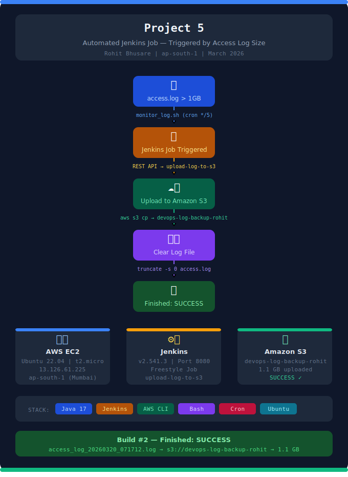

# 🚀 Project 5 - Automated Jenkins Job Triggered by Access Log Size



---

## 📌 Objective

Create a system where a Jenkins job is triggered **automatically** when an access log file exceeds **1GB** in size. Once triggered, the Jenkins job must:

1. **Transfer** the log file to a specific **Amazon S3 bucket**
2. **Clear** the contents of the original access log file after successful transfer

---

## 🛠️ Tech Stack

| Tool | Version | Purpose |
|------|---------|---------|
| AWS EC2 | Ubuntu 22.04 LTS | Jenkins Server |
| Jenkins | 2.541.3 | CI/CD Automation |
| Java | OpenJDK 17 | Jenkins Runtime |
| AWS CLI | v2.34.13 | S3 Upload |
| Amazon S3 | - | Log File Storage |
| Bash | - | Monitoring Script |
| Cron | - | Auto Scheduling (*/5 min) |

---

## 📁 Project Structure

```
Project-5-jenkins-log-monitor/
├── screenshots/
│   ├── Screenshot 2026-03-20 154803.png   # Jenkins Job Parameter
│   ├── Screenshot 2026-03-20 155405.png   # Jenkins Job Created
│   ├── Screenshot 2026-03-20 160840.png   # Jenkins API Token
│   ├── Screenshot 2026-03-20 161954.png   # Crontab Editor
│   ├── Screenshot 2026-03-20 162232.png   # EC2 Instance Running
│   ├── Screenshot 2026-03-20 162520.png   # Jenkins Build SUCCESS
│   ├── Screenshot 2026-03-20 162654.png   # S3 Upload Proof
│   ├── Screenshot 2026-03-20 162729.png   # Jenkins Final Status
│   ├── Screenshot 2026-03-20 164312.png   # Crontab -l & Script
│   └── Screenshot 2026-03-20 164435.png   # AWS Configure & Script
├── monitor_log.sh      # Shell script to monitor log size
├── Jenkinsfile         # Jenkins job shell script
└── README.md           # This file
```

---

## ⚙️ Complete Step-by-Step Implementation

---

### ✅ Step 1: Launch EC2 Instance on AWS

1. Login to **AWS Console** → Search **EC2** → Click **Launch Instances**
2. Configure:
   - **Name:** `JENKINS`
   - **OS:** Ubuntu Server 22.04 LTS
   - **Instance Type:** t2.micro (Free Tier)
   - **Key Pair:** Create new or use existing
   - **Security Group:** Open Port **22** (SSH) and Port **8080** (Jenkins)
3. Click **Launch Instance**

**Instance Details:**
- Instance ID: `i-0d80323f7fc04abfc`
- Public IP: `13.126.61.225`
- Region: `ap-south-1a`

### 📸 Screenshot 1 - EC2 Instance Running


---

### ✅ Step 2: Connect to EC2 & Update System

```bash
# Connect via SSH
ssh -i your-key.pem ubuntu@13.126.61.225

# Update system packages
sudo apt update
```

**Output:**
```
Fetched 40.8 MB in 8s (5222 kB/s)
Reading package lists... Done
12 packages can be upgraded.
```

---

### ✅ Step 3: Install Java (Jenkins Prerequisite)

```bash
sudo apt install openjdk-17-jdk -y
java -version
```

**Output:**
```
openjdk version "17.0.18" 2026-01-20
OpenJDK Runtime Environment (build 17.0.18+8-Ubuntu-124.04.1)
OpenJDK 64-Bit Server VM (build 17.0.18+8-Ubuntu-124.04.1, mixed mode, sharing)
```

---

### ✅ Step 4: Install Jenkins

```bash
# Download Jenkins GPG Key
sudo wget -O /usr/share/keyrings/jenkins-keyring.asc \
  https://pkg.jenkins.io/debian-stable/jenkins.io-2023.key

# Add Jenkins Repository
echo "deb [trusted=yes] https://pkg.jenkins.io/debian-stable binary/" | \
  sudo tee /etc/apt/sources.list.d/jenkins.list > /dev/null

# Install Jenkins
sudo apt update
sudo apt install jenkins -y

# Start Jenkins
sudo systemctl start jenkins
sudo systemctl status jenkins
```

**Output:**
```
● jenkins.service - Jenkins Continuous Integration Server
   Active: active (running) since Fri 2026-03-20 06:41:10 UTC
```

Jenkins Dashboard: `http://13.126.61.225:8080`

---

### ✅ Step 5: Install AWS CLI v2

```bash
# Download AWS CLI
curl "https://awscli.amazonaws.com/awscli-exe-linux-x86_64.zip" -o "awscliv2.zip"

# Unzip and Install
sudo apt install unzip -y && unzip awscliv2.zip
sudo ./aws/install

# Verify
aws --version
```

**Output:**
```
aws-cli/2.34.13 Python/3.14.3 Linux/6.17.0-1007-aws exe/x86_64.ubuntu.24
```

---

### ✅ Step 6: Configure AWS Credentials

```bash
aws configure
```

```
AWS Access Key ID     : ********************
AWS Secret Access Key : ********************
Default region name   : ap-south-1
Default output format : json
```

```bash
# Copy credentials for Jenkins user
sudo mkdir -p /var/lib/jenkins/.aws
sudo cp ~/.aws/credentials /var/lib/jenkins/.aws/credentials
sudo cp ~/.aws/config /var/lib/jenkins/.aws/config
sudo chown -R jenkins:jenkins /var/lib/jenkins/.aws
```

### 📸 Screenshot 2 - AWS Configure & Script Execution


---

### ✅ Step 7: Create S3 Bucket

```bash
# Create bucket
aws s3 mb s3://devops-log-backup-rohit --region ap-south-1

# Verify
aws s3 ls
```

**Output:**
```
2026-03-16 08:13:19 devops-log-backup-rohit
```

**S3 Bucket Name:** `devops-log-backup-rohit`

---

### ✅ Step 8: Create Jenkins Freestyle Job

1. Open Jenkins: `http://13.126.61.225:8080`
2. Click **New Item** → Name: `upload-log-to-s3` → Select **Freestyle project** → **OK**
3. Check **"This project is parameterised"**
4. Click **Add Parameter** → **String Parameter**
   - **Name:** `LOG_FILE_PATH`
   - **Default Value:** `/var/log/httpd/access.log`

### 📸 Screenshot 3 - Jenkins Job Parameter (LOG_FILE_PATH)


---

### ✅ Step 9: Add Build Step - Execute Shell

Scroll to **Build Steps** → **Add build step** → **Execute shell**

Paste this script:

```bash
#!/bin/bash
TIMESTAMP=$(date '+%Y%m%d_%H%M%S')
S3_BUCKET="devops-log-backup-rohit"
AWS_REGION="ap-south-1"
LOG_FILE="${LOG_FILE_PATH}"

echo "Uploading $LOG_FILE to S3..."
aws s3 cp "$LOG_FILE" \
  "s3://$S3_BUCKET/access-logs/access_log_${TIMESTAMP}.log" \
  --region $AWS_REGION

if [ $? -eq 0 ]; then
    echo "Upload successful!"
    sudo truncate -s 0 "$LOG_FILE"
    echo "Log file cleared!"
else
    echo "Upload FAILED!"
    exit 1
fi
```

Click **Save**

### 📸 Screenshot 4 - Jenkins Job Created Successfully


---

### ✅ Step 10: Generate Jenkins API Token

1. Jenkins → Click username **rohit bhusare** (top right)
2. Click **Security**
3. Click **Add new Token** → Name: `monitor-token`
4. Click **Generate** → Copy the token

### 📸 Screenshot 5 - Jenkins API Token Generated


---

### ✅ Step 11: Create Monitoring Shell Script

```bash
# Create directory
sudo mkdir -p /opt/scripts

# Create script
sudo nano /opt/scripts/monitor_log.sh
```

**Script Content:**

```bash
#!/bin/bash
LOG_FILE="/var/log/httpd/access.log"
SIZE_LIMIT=$((1 * 1024 * 1024 * 1024))
JENKINS_URL="http://localhost:8080"
JENKINS_JOB="upload-log-to-s3"
JENKINS_USER="rohit"
JENKINS_TOKEN="1127f552c6fea6bfe5da3eb948b6f53a71"
SCRIPT_LOG="/var/log/monitor_log.log"

log_msg() {
    echo "[$(date '+%Y-%m-%d %H:%M:%S')] $1" | tee -a "$SCRIPT_LOG"
}

FILE_SIZE=$(stat -c%s "$LOG_FILE")
log_msg "Current size: $FILE_SIZE bytes"

if [ "$FILE_SIZE" -ge "$SIZE_LIMIT" ]; then
    log_msg "ALERT: File exceeds 1GB! Triggering Jenkins..."
    HTTP_CODE=$(curl -s -o /dev/null -w "%{http_code}" \
        -X POST \
        --user "$JENKINS_USER:$JENKINS_TOKEN" \
        "$JENKINS_URL/job/$JENKINS_JOB/build")
    log_msg "Jenkins response: $HTTP_CODE"
else
    log_msg "INFO: File size OK. No action needed."
fi
```

```bash
# Make executable
sudo chmod +x /opt/scripts/monitor_log.sh
```

---

### ✅ Step 12: Create Test Log File (1.1 GB)

```bash
# Create log directory
sudo mkdir -p /var/log/httpd

# Create 1.1 GB test file
sudo dd if=/dev/zero of=/var/log/httpd/access.log bs=1M count=1100
```

**Output:**
```
1100+0 records in
1100+0 records out
1153433600 bytes (1.2 GB, 1.1 GiB) copied, 16.0697 s, 71.8 MB/s
```

---

### ✅ Step 13: Test the Monitoring Script

```bash
sudo /opt/scripts/monitor_log.sh
```

**Output:**
```
[2026-03-20 07:12:57] Current size: 1153433600 bytes
[2026-03-20 07:12:57] ALERT: File exceeds 1GB! Triggering Jenkins...
[2026-03-20 07:12:58] Jenkins response: 201
```

### 📸 Screenshot 6 - Script Running & Crontab Output


---

### ✅ Step 14: Setup Cron Job (Every 5 Minutes)

```bash
crontab -e
```

Add this line at the bottom:
```
*/5 * * * * /opt/scripts/monitor_log.sh
```

Save with **Ctrl+O** → Enter → **Ctrl+X**

Verify:
```bash
crontab -l
```

**Output:**
```
*/5 * * * * /opt/scripts/monitor_log.sh
```

### 📸 Screenshot 7 - Crontab Editor with Cron Job


---

## ✅ Results & Proof

### 📸 Screenshot 8 - Jenkins Build #2 Console Output - UPLOAD SUCCESS


**Console shows:**
```
Completed 1.1 GiB/1.1 GiB (62.9 MiB/s)
upload: ../../../../log/httpd/access.log to s3://devops-log-backup-rohit/access-logs/access_log_20260320_071712.log
Upload successful!
Log file cleared!
Finished: SUCCESS
```

---

### 📸 Screenshot 9 - S3 Bucket - File Uploaded (1.1 GB)


**S3 Details:**
- **Bucket:** `devops-log-backup-rohit`
- **File:** `access_log_20260320_071712.log`
- **Size:** `1.1 GB`
- **Date:** March 20, 2026

---

### 📸 Screenshot 10 - Jenkins Job Final Status (Build #2 ✅ SUCCESS)


---

## 📋 Final Deliverables Summary

| # | Deliverable | Details | Status |
|---|-------------|---------|--------|
| 1 | `monitor_log.sh` | Shell script — monitors log size & triggers Jenkins via REST API | ✅ Done |
| 2 | Jenkins Freestyle Job | `upload-log-to-s3` — uploads to S3, verifies, clears log | ✅ Done |
| 3 | S3 Upload Proof | `access_log_20260320_071712.log` — 1.1 GB uploaded | ✅ Done |
| 4 | Log File Cleared | `truncate -s 0` after successful upload | ✅ Done |
| 5 | Cron Job | `*/5 * * * *` — runs every 5 minutes | ✅ Done |
| 6 | Jenkins API Token | `monitor-token` generated for REST API auth | ✅ Done |
| 7 | AWS CLI v2 | Configured with ap-south-1 region | ✅ Done |
| 8 | 10 Screenshots | All steps documented with proof | ✅ Done |
| 9 | README.md | Complete step-by-step documentation | ✅ Done |

---

## 🔗 Resources

- **Jenkins URL:** `http://13.126.61.225:8080`
- **S3 Bucket:** `s3://devops-log-backup-rohit/access-logs/`
- **EC2 Instance:** `i-0d80323f7fc04abfc` (ap-south-1a)
- **Log File:** `/var/log/httpd/access.log`
- **Monitor Script:** `/opt/scripts/monitor_log.sh`
- **Cron:** `*/5 * * * * /opt/scripts/monitor_log.sh`

---

*✅ Project 5 Completed Successfully — March 20, 2026 — Rohit Bhusare* 🚀
